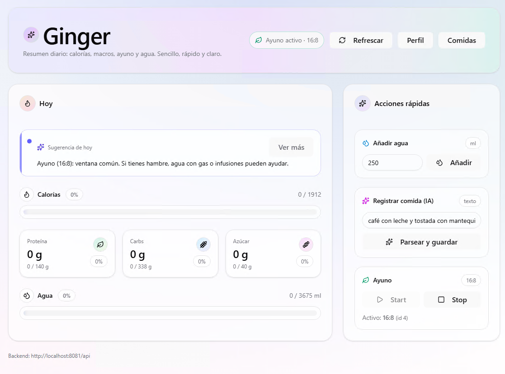
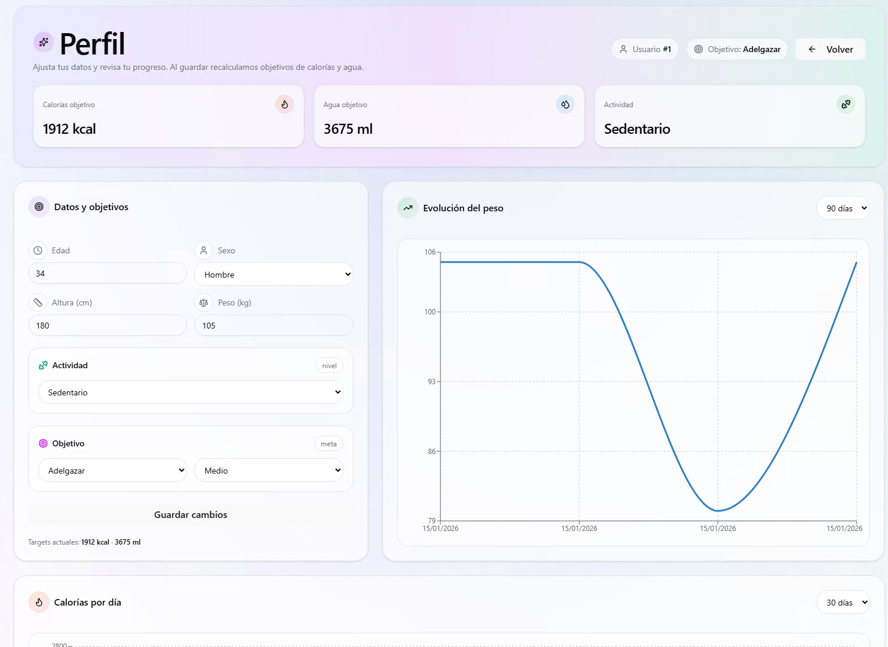

# 🥑 Ginger - Tu Asistente Nutricional Inteligente

**Ginger** es una plataforma integral para el seguimiento nutricional que combina una interfaz moderna y fluida con un backend robusto potenciado por IA. Simplifica el registro de calorías, macros y ayuno intermitente mediante procesamiento de lenguaje natural.



## ✨ Características

* **🤖 Registro con IA:** Escribe lo que comiste (ej. *"arroz con pollo"*) y el sistema procesa automáticamente las calorías y macros gracias al módulo de IA del backend.
* **📊 Dashboard Interactivo:** Visualización en tiempo real de calorías, proteínas, carbohidratos, azúcar e hidratación.
* **⏱️ Control de Ayuno:** Temporizador integrado para protocolos (ej. 16:8) sincronizado con tu ingesta.
* **📈 Evolución:** Gráficos de peso y ajustes automáticos de objetivos basados en tu TDEE y datos biométricos.
* **📱 Diseño Responsive:** Interfaz adaptada a cualquier dispositivo.

## 🏗️ Arquitectura del Proyecto

El proyecto está estructurado como un monorepo con separación clara de responsabilidades:

```text
Ginger/
├── backend/            # API REST con Spring Boot & Java
├── frontend/           # SPA con React, TypeScript & Vite
├── infra/              # Configuración de Docker Compose
└── res/                # Recursos estáticos (imágenes)
```

## 🛠️ Tech Stack

### Frontend (Client-Side)
* **Framework:** [React](https://react.dev/) + [Vite](https://vitejs.dev/)
* **Lenguaje:** TypeScript (`.tsx`, `.ts`)
* **Estilos:** [Tailwind CSS](https://tailwindcss.com/)
* **Componentes UI:** [shadcn/ui](https://ui.shadcn.com/) (basado en la carpeta `components/ui` y `components.json`)
* **Gestión de Estado/Datos:** React Hooks & Props

### Backend (Server-Side)
* **Framework:** [Spring Boot](https://spring.io/projects/spring-boot)
* **Lenguaje:** Java
* **Gestor de Dependencias:** Gradle (Wrappers incluidos: `gradlew`)
* **Arquitectura:** Capas (Controller, Service, Repository, Domain)
* **Inteligencia Artificial:** Módulo dedicado `com.ginger.backend.ai` para el procesamiento de texto.

### Infraestructura
* **Contenedorización:** Docker
* **Orquestación:** Docker Compose (configuración en `infra/docker-compose.yml`)

## 🚀 Instalación y Despliegue

Sigue estos pasos para ejecutar el proyecto en local:

### Prerrequisitos
* Node.js (v24 o superior)
* NPM o Yarn
* Backend corriendo en el puerto `8081` (o configurar variable de entorno).

### Pasos

1.  **Clonar el repositorio:**
    ```bash
    git clone [https://github.com/tu-usuario/ginger-app.git](https://github.com/tu-usuario/ginger-app.git)
    cd ginger-app
    ```

2.  **Instalar dependencias:**
    ```bash
    npm install
    # o
    yarn install
    ```

3.  **Configurar Variables de Entorno:**
    Crea un archivo `.env.local` en la raíz del proyecto:
    ```env
    NEXT_PUBLIC_API_URL=http://localhost:8081/api
    NEXT_PUBLIC_LLM_API_KEY=tu_api_key_aqui
    ```

4.  **Iniciar el servidor de desarrollo:**
    ```bash
    npm run dev
    ```

5.  Abre [http://localhost:3000](http://localhost:3000) en tu navegador.

## 📸 Galería

|       Historial de Comidas        |      Perfil de Usuario       |
|:---------------------------------:|:----------------------------:|
|  |  |

## 🤝 Contribución

Las contribuciones son bienvenidas. Por favor, abre un *issue* primero para discutir qué te gustaría cambiar.

1.  Haz un Fork del proyecto.
2.  Crea tu rama de funcionalidad (`git checkout -b feature/AmazingFeature`).
3.  Haz Commit de tus cambios (`git commit -m 'Add some AmazingFeature'`).
4.  Haz Push a la rama (`git push origin feature/AmazingFeature`).
5.  Abre un Pull Request.

## 📝 Licencia

Distribuido bajo la licencia MIT. Ver `LICENSE` para más información.

---
*Backend endpoint visible en las capturas: `http://localhost:8081/api`*